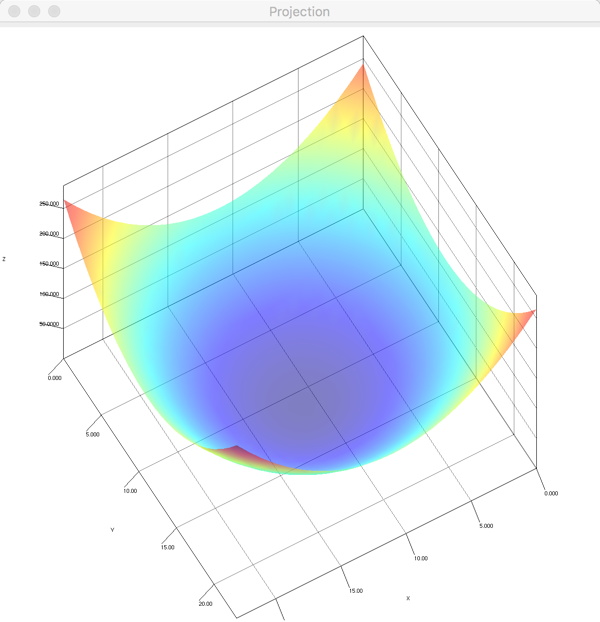
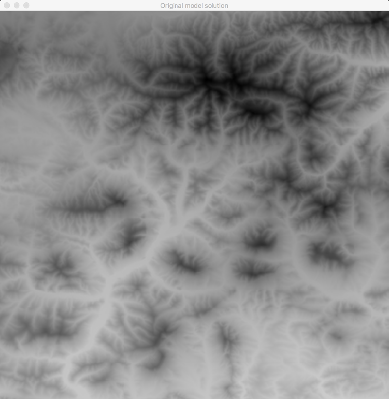
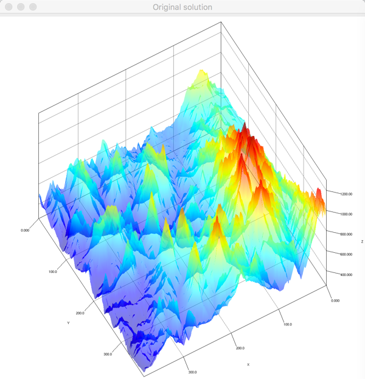

# Isogeometric Alternating Directions Implicit Shared Memory Solver (IGA-ADI-SM)


## TL;DR;

This numerical solver can be used for solving a certain subset of problems
in the field of Isogeometric Analysis. Utilizes an implicit Euler scheme which removes the dependency of time step size and mesh size.
In other words the time step can be arbitrarily long (it will never cause instability).
This in turn allows to perform efficient analysis of behavior in dense meshes.

## Table of contents
- [Isogeometric Alternating Directions Implicit Shared Memory Solver (IGA-ADI-SM)](#isogeometric-alternating-directions-implicit-shared-memory-solver-iga-adi-sm)
    - [TL;DR;](#tldr)
    - [Table of contents](#table-of-contents)
    - [Code coverage](#code-coverage)
    - [Usage](#usage)
        - [Common configuration properties](#common-configuration-properties)
        - [Example problems](#example-problems)
            - [Projection problem](#projection-problem)
            - [Heat transfer problem](#heat-transfer-problem)
            - [Terrain mapping](#terrain-mapping)
        - [Solving different problem](#solving-different-problem)
        - [Want to contribute?](#want-to-contribute)
        - [Terrain maps](#terrain-maps)
        - [Contact & More information](#contact--more-information)

## Code coverage

As percentage-based code coverage alone is a bit misleading for solvers such as this,
the great majority of the tests relate to the core of the solver rather than to secondary functionality like results visualisation etc. For detailed results see [codecov dashboard](https://codecov.io/gh/kboom/iga-adi-sm/branch/master/).


## Usage

To run the solver just issue

```bash
java -jar iga-adi-sm-<version>.jar <arguments>
```

Where the java archive can be downloaded directly from releases page. For example, the heat transfer simulations with 100 steps with a plot would be run after issuing the following command:
```bash
java -jar iga-adi-sm-1.0.0.jar --problem heat --steps 100 --plot
```
Make sure *JRE* (1.8+) is installed on the system and available on the *PATH*.
The program can be run by providing configuration properties all of which have default values. 

### Common configuration properties

Even if every problem defines its own set of configuration properties
there is a subset common to every problem. Those are:

- **--log** / **-l** => logging detailed results (**off** by default)
- **--plot** / **-p** => plotting results (**on** by default)
- **--problem-size** / **-s** => specifying problem size (**12** by default)
- **--max-threads** / **-t** => enforcing maximum number of threads used (**12** by default)


### Example problems

This software comes with several exemplary problems pre-implemented.
Those are:
- Projection problem (**projection**)
- Heat Transfer simulation (**heat**)
- Terrain mapping incl. SVD approximation (**terrain-svd**)
- Flood simulation (**flood**)

The type of problem is selected by a configuration parameter **--problem**
supplied with the short name from above, for instance **--problem projection**.

#### Projection problem

The projection problem solved is a simple 
```
f(x) = (x - MaxX/2)^2 + (y - MaxY / 2)^2
```
function projection. No additional configuration properties may be provided.



#### Heat transfer problem

In this example an exemplary problem of heat transfer is being solved. 
A ball of heat is put into the center of the plane gradually heating the surface. 
The grid size is 24x24 though it can be any value.

Additional configuration properties are:
- **--delta** / **-d** => time step (**0.1** by default - beware of bigger error)
- **--steps** / **-o** => number of time steps to run simulation for (**100** by default)


#### Terrain mapping

The terrain mapping takes as input the path to the file containing triplets of x,y,z values in each line.
It does the projection of it and then Singular Value Decomposition (SVD). You can choose what rank to use.
If no file is provided the program uses a static terrain generated using a simple math function.

Additional configuration properties are:
- **--terrain-file** => terrain file to use (**none** by default)
- **--scale** => scale (**1** by default)
- **--xOffset** => time step (**0** by default)
- **--yOffset** => time step (**0** by default)
- **--ranks** => time step (**10** by default)




### Solving different problem

Code can be easily modified to solve a different problem. 
If you need to solve a static problem with only one time step then you just need to create proper implementation of **ProblemManager**,
which constructs your unique **Problem** instance (or just uses lambda).


```java
public class ProjectionProblemManager extends AbstractProblemManager {

    public ProjectionProblemManager(SolverConfiguration config) {
        super(config);
    }

    @Override
    public IterativeProblem getProblem() {
        return new SingleRunProblem() {

            @Override
            protected Problem getProblem() {
                return (x, y) -> x + y; // your numeric result
            }

        };
    }

}
```
This way the solver will produce a 3D visualization of the projection done.
If you want to pre-process the input or post-process the results you can override respective methods which are available and contain default implementations.

If you want to solve a time-dependent problem or any iterative problem in general do not use the **SingleRunProblem** class as the base class for your problem.
Rather that that implement the **IterativeProblem** interface.

### Want to contribute?

Feel free to contribute to this project. Merge requests will be reviewed and accepted upon verification.

### Terrain maps

* [Geospatial selection](http://srtm.csi.cgiar.org/SELECTION/inputCoord.asp)
* [1 meter elevation map resources](https://thor-f5.er.usgs.gov/ngtoc/metadata/waf/elevation/1_meter/img/)
* [Google elevation API](https://developers.google.com/maps/documentation/elevation/start)
* [CSV elevation maps](https://catalog.data.gov/dataset?tags=elevation&res_format=CSV)
* [San Francisco 5ft](https://data.sfgov.org/api/views/mi5i-wqjv/rows.csv?accessType=DOWNLOAD)
* [Free GIS resources](https://freegisdata.rtwilson.com/)
* [Global elevation](http://srtm.csi.cgiar.org/)
* [Maps](http://www.naturalearthdata.com/downloads/)
* [Small scale maps](https://nationalmap.gov/small_scale/atlasftp.html)
* [Direct links to elevation maps](https://nationalmap.gov/small_scale/atlasftp.html#elevhii)
* [TIF files](http://www.cgiar-csi.org/data/srtm-90m-digital-elevation-database-v4-1#download)
* [QGis](https://qgis.org/pl/site/)
* [Poland NMT](http://www.codgik.gov.pl/index.php/darmowe-dane/nmt-100.html)


### Contact & More information

* [http://home.agh.edu.pl/~paszynsk/](http://home.agh.edu.pl/~paszynsk/)
* [http://home.agh.edu.pl/~kbhit/](http://home.agh.edu.pl/~kbhit/)


